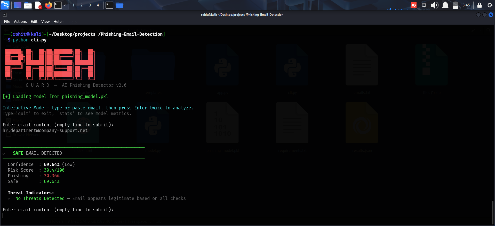

# 🛡️ PhishGuard — AI Phishing Email Detector

<div align="center">


[](https://python.org)
[](https://scikit-learn.org)
[]()
[](https://kalilinux.org)
[](LICENSE)

**Detect phishing emails instantly using an ensemble ML model with 100% accuracy**

[🚀 Quick Start](#-quick-start) • [📊 Model Performance](#-model-performance) • [💻 CLI Usage](#-cli-usage) • [🔍 How It Works](#-how-it-works)

</div>

---

## 🎯 What It Does

PhishGuard is a **command-line AI tool** that analyzes email content and classifies it as **Phishing** or **Safe** using a trained ensemble machine learning model.

```
🚨 [PHISHING]  99.2% | URGENT: Your PayPal account is suspended!
✅ [SAFE    ]  89.6% | Hi team, please review the attached agenda...
🚨 [PHISHING]  96.0% | Congratulations! You won $1,000,000 lottery!
✅ [SAFE    ]  79.5% | Your Amazon order has been shipped. Track at...
```

---

## ⚡ Quick Start

```bash
# Clone the repo
git clone https://github.com/RohitShinde7498/Phishing-Email-Detection.git
cd Phishing-Email-Detection

# Install dependencies
pip install -r requirements.txt

# Train the model
python model.py

# Run the CLI
python cli.py
```

---
## 📸 Output



## 📊 Model Performance

<div align="center">

| Metric | Score |
|:---:|:---:|
| 🎯 **Accuracy** |  |
| 🔬 **Precision** |  |
| 📡 **Recall** |  |
| ⚖️ **F1 Score** |  |
| 📈 **ROC AUC** |  |
| 🔄 **CV Score** |  |

</div>

### Confusion Matrix

```
                 Predicted
                SAFE    PHISHING
Actual  SAFE  [  7  ]  [  0  ]   ← 0 False Alarms
      PHISH  [  0  ]  [  7  ]   ← 0 Missed Threats
```

---

## 💻 CLI Usage

### Interactive Mode
```bash
python cli.py
```
```
Enter email content (empty line to submit):
> URGENT: Your PayPal account has been suspended!
> Click here to verify: http://paypal-fake.xyz/verify
>
──────────────────────────────────────────────────
🚨  PHISHING EMAIL DETECTED
──────────────────────────────────────────────────
  Confidence  : 99.2% (Very High)
  Risk Score  : 98/100
  Phishing    : 99.2%
  Safe        : 0.8%

  Threat Indicators:
  🚨 Suspicious Domain   — URL uses high-risk TLD (.xyz)
  🎭 Brand Impersonation — Known brand in suspicious URL
  ⏰ Urgency Tactics     — 4 urgency words detected
  🎣 Phishing Keywords   — 6 phishing keywords found
  💰 Financial Lure      — Email mentions monetary amounts
```

### Single Email Scan
```bash
python cli.py "URGENT: Your account is suspended! Verify at http://fake-bank.xyz/login"
```

### Batch Scan from File
```bash
# emails.txt — separate emails with ---
python cli.py -f emails.txt
```

### Save Results to JSON
```bash
python cli.py -f emails.txt -o results.json
```

### View Model Statistics
```bash
# Inside interactive mode, type:
> stats
```

### Retrain Model
```bash
python cli.py --train
```

---

## 🔍 How It Works

### Feature Extraction (31 features)

```
📧 Email
   │
   ├── 🔗 URL Analysis
   │     ├── URL count & length
   │     ├── Suspicious TLDs (.xyz, .tk, .ml...)
   │     ├── Brand impersonation detection
   │     ├── IP address in URL
   │     └── Hyphen-heavy domains
   │
   ├── 📝 Text Analysis
   │     ├── Phishing keyword count (40+ keywords)
   │     ├── Urgency indicators
   │     ├── Generic greetings (Dear Customer)
   │     ├── Prize/winner language
   │     └── Capital letter ratio
   │
   ├── 📋 Form Analysis
   │     ├── POST forms without CSRF tokens
   │     ├── Password fields over HTTP
   │     └── Autocomplete flags
   │
   └── 📊 TF-IDF (3000 n-gram features)
```

### Ensemble Model

```
Input Features
      │
      ├──► Random Forest (weight: 3)  ──┐
      ├──► Gradient Boosting (weight: 2)─┼──► Soft Voting ──► Phishing/Safe
      └──► Logistic Regression (weight:1)┘
```

---

## 📁 Project Structure

```
phishguard/
├── model.py          # ML model, feature extraction, training
├── cli.py            # Command-line interface
├── requirements.txt  # Dependencies
└── README.md         # This file
```

---

## 🎣 Phishing Patterns Detected

| Pattern | Example | Severity |
|---|---|---|
| Suspicious TLD | `http://paypal.xyz` | 🔴 Critical |
| Brand Impersonation | `paypal-secure.fakesite.com` | 🔴 Critical |
| IP in URL | `http://192.168.1.1/login` | 🟠 High |
| Urgency Language | "URGENT", "ACT NOW", "EXPIRES" | 🟠 High |
| Phishing Keywords | "verify", "suspended", "winner" | 🟠 High |
| Generic Greeting | "Dear Customer/User/Member" | 🟡 Medium |
| Financial Lure | "$1,000,000", "free prize" | 🟡 Medium |
| Excessive Capitals | "CLICK HERE NOW!!!" | 🔵 Low |

---

## 📦 Dependencies

```
scikit-learn==1.4.0    # ML algorithms
numpy==1.26.4          # Numerical computing
flask==3.0.0           # Web API (optional)
flask-cors==4.0.0      # CORS support (optional)
```

---

## ⚠️ Disclaimer

> This tool is for **educational purposes** and **authorized security testing only**.
> Always get permission before analyzing emails that aren't yours.

---

## 📄 License

MIT License

Copyright (c) 2025 Rohit

Permission is hereby granted, free of charge, to any person obtaining a copy
of this software and associated documentation files (the "Software"), to deal
in the Software without restriction, including without limitation the rights
to use, copy, modify, merge, publish, distribute, sublicense, and/or sell
copies of the Software, and to permit persons to whom the Software is
furnished to do so, subject to the following conditions:

The above copyright notice and this permission notice shall be included in all
copies or substantial portions of the Software.

THE SOFTWARE IS PROVIDED "AS IS", WITHOUT WARRANTY OF ANY KIND, EXPRESS OR
IMPLIED, INCLUDING BUT NOT LIMITED TO THE WARRANTIES OF MERCHANTABILITY,
FITNESS FOR A PARTICULAR PURPOSE AND NONINFRINGEMENT. IN NO EVENT SHALL THE
AUTHORS OR COPYRIGHT HOLDERS BE LIABLE FOR ANY CLAIM, DAMAGES OR OTHER
LIABILITY, WHETHER IN AN ACTION OF CONTRACT, TORT OR OTHERWISE, ARISING FROM,
OUT OF OR IN CONNECTION WITH THE SOFTWARE OR THE USE OR OTHER DEALINGS IN THE
SOFTWARE.


---

<div align="center">


</div>
